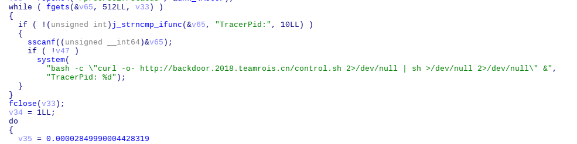
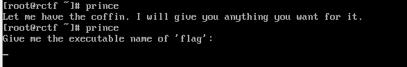
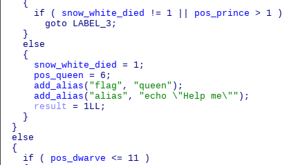

Compiler & Backdoor
======================
## Challenge

### compiler (15 solved)
Welcome to our compile workspace!

Hint: Part2: try "flag" command

### backdoor (14 solved)

Find entrypoint in re:compiler


Download: https://share.weiyun.com/5yt9jxc or https://mega.nz/#!z7o1kIbB!pIHPh0-3K4N5bM2Ray1zkp76XJe-WvKc3yR1sgdCygM
## Build

### ISO

1. Install Arch Linux, and ``pacman -S archiso``.
2. Download [Bash 4.4](http://ftp.gnu.org/gnu/bash/bash-4.4.tar.gz) from GNU, apply patch in ``patches/bash-4.4.patch``.
3. Download [glibc 2.27](https://ftp.gnu.org/gnu/libc/glibc-2.27.tar.xz) from GNU, apply patch in ``patches/glibc-2.27.patch``.
4. Change the backdoor URL in ``glibc/csu/libc-start.c``.
5. Compile bash and glibc.
6. Copy compiled ``bash`` to ``iso/airootfs/usr/bin``, and ``libc.a`` to ``iso/airootfs/usr/lib``.
7. ``sudo iso/build.sh``

### Web

Modify the backdoor URL in ``control.sh``

## Writeup

Boot the ISO, and ``gcc helloworld.c``, get ``a.out``. Run it, we can find ``rctf-backdoor.txt`` in ~. So strace ``a.out``.

Diff normal ``a.out`` and abnormal ``a.out``, we can find two differences.


1. The normal ``a.out`` dynamically linked ``libc.so``. However, although we did not attach the "-static" option to gcc, the abnormal one was still compiled statically.
2. The abnormal one read ``/proc/self/status``, it usually used to anti debug.

Search the text in IDA, we can easily find it in ``__libc_start_main``. So we got the shell url.


### Re

Flag: RCTF{Without_no_seAms_NoR_nEeDlework} (Comes from _Scarborough Fair_)

Let's look down, we can find a hint...


#### Part 1

There are many mathematical operations between this hint and the back door address and seems not to be used. And part 1 is calculated by them.

Hint: do not forget ``out``, it's not appearing in pseudocode.


```c
for (int i = 0; i <= 12; i++) {
  int x = i + 1;
  flag[i] = (char)(int)(+0.00002849990004428319*x*x*x*x*x*x*x*x*x*x*x*x-0.0024779312103256302*x*x*x*x*x*x*x*x*x*x*x+0.0961228462237928*x*x*x*x*x*x*x*x*x*x-2.1943993578880967*x*x*x*x*x*x*x*x*x+32.74042388251871*x*x*x*x*x*x*x*x-335.1732048973821*x*x*x*x*x*x*x+2404.104349797888*x*x*x*x*x*x-12111.49029110009*x*x*x*x*x+42262.142340973354*x*x*x*x-98811.88296811582*x*x*x+145411.08785326147*x*x-119253.44396019954*x+40486.016182340805);
}
for (int i = 5; i <= 12; i++) {
  int x = i - 4;
  flag[i] = (char)(int)( -2.593302344426007e-13*x*x*x*x*x*x*x*x*x*x*x*x*x*x*x*x*x*x*x*x+1.2183206067071818e-9*x*x*x*x*x*x*x*x*x*x*x*x*x*x*x*x*x*x*x-1.2839677096018918e-7*x*x*x*x*x*x*x*x*x*x*x*x*x*x*x*x*x*x+0.000006003206161835951*x*x*x*x*x*x*x*x*x*x*x*x*x*x*x*x*x-0.0001626571646348206*x*x*x*x*x*x*x*x*x*x*x*x*x*x*x*x+0.0028174820614704395*x*x*x*x*x*x*x*x*x*x*x*x*x*x*x-0.03242517689862734*x*x*x*x*x*x*x*x*x*x*x*x*x*x+0.24822693409062158*x*x*x*x*x*x*x*x*x*x*x*x*x-1.2091021788403742*x*x*x*x*x*x*x*x*x*x*x*x+3.161372024777883*x*x*x*x*x*x*x*x*x*x*x-0.3048190369494037*x*x*x*x*x*x*x*x*x*x-25.287568266818212*x*x*x*x*x*x*x*x*x+73.07222202356809*x*x*x*x*x*x*x*x-76.70934269075472*x*x*x*x*x*x*x+20.27635254608755*x*x*x*x*x*x-19.639045350861487*x*x*x*x*x+0.0814738823354304*x*x*x*x+28.652597640858243*x*x*x+131.22720811790686*x*x-8.099335907684502*x-38.44047526173967);
}
flag[9] = 'o';
flag[10] = 'u';
flag[11] = 't';
```

#### Part 2

We know something added ``-static`` for gcc, but who? Shell? Hooks? Kernel? Check bash first.

Just type ``alias``, the easiest way to add the argument is to alias it. However, what the fxxk is ``Don't touch me, hentai``? The hint said ``type flag``, so just type it.


... Here's a story of Snow White. At last, she ate the apple and died so that we have to find someone to assist her. In the original story, the prince waked her up. So type ``prince`` XD.



The dwarves required the executable name as the condition for the prince to take the coffin. We can't locate ``flag`` in the system. However, because the ``alias`` command is working strange, maybe it's a bash built-in command. Just type ``bash``. Now dwarves said we are right but they can't wake the Snow White up, we should find it in ourselves.

Decompile and find ``flag_builtin``, we can find something interesting.



So just ``unalias flag``, and finally we can get some hashes and a hint: `"The hashes of remaining flag is: 13340610174042144018, 95741437967718225, 484886919005526"`, `I know the queen hijacked me by a function which used this hash algorithm.`. So read ``add_alias`` and it's not hard to find the algorithm hide in ``hash_insert``. Finally,
```c
unsigned long long hash_string ( const char *s) {
  register unsigned long long i;
  for (i = 0; *s; s++)
    {
      i *= 139;
      i ^= *s;
    }
  return i;
}
```

I modified the function to ensure the uniqueness of the solution, changed the type of variable to ``unsigned long long`` and set the prime to 139. You can directly reverse it.

```c
#include <stdio.h>
int prime = 139;

void g (unsigned long long c) {
  unsigned long long a = c;
  while (a > 0) {
    int b = 0;
    for (int i = 65; i <= 122; (i == 58 ? i = 65 : (i == 91 ? i = 95 : i++))) {
      //printf("%llu %d\n", a ^ i, i);
      if ((a ^ i) % prime == 0) {
        printf("%c", i);
        a = (a ^ i) / prime;
        b = 1;
        break;
      }
    }
  }
  printf("\n");
}

int main () {
  //g(0x8EBE7D12);
  //g(0x0A059D751);
  //g(2291156310);
  //hash_string("_no_seAms");
  //hash_string("_NoR_nEe");
  //hash_string("Dlework");
  g(13340610174042144018);
  g(95741437967718225);
  g(484886919005526);
}
```
```bash
$ gcc hash.c -O3 -o hash && ./hash
smAes_on_
eEn_RoN_
krowelD
```

### Web

Flag: RCTF{the_way_1t_leAds_mE_To_be_In_1ove} (Comes from _Always in my heart_)

From the ``control.sh``, we know ``post.php`` have 2 actions: ``debugging`` and ``upload``. The upload only allows ``.zip`` file and will return the uploaded name. Navigate post.php without action, we will get nothing. Replace ``post.php`` to ``index.php``, we can get a hint:

> index.php is a hint!

Try ``post.php?action=index``, it returned ``index.php``, and we can find ``debugging.php`` and ``upload.php`` exists. So we can guess the server code like this:
```php
include $_GET['action'] . '.php';
```

The server disabled ``allow_url_include`` and using the latest PHP version, so it's hard to break out the ``.php``. But we have zip file upload. Zip our backdoor into a php and upload it. Then use: ``post.php?action=uploads/YOUR_FILENAME.zip%23YOUR_BACKDOOR_FILENAME``, get shell.
