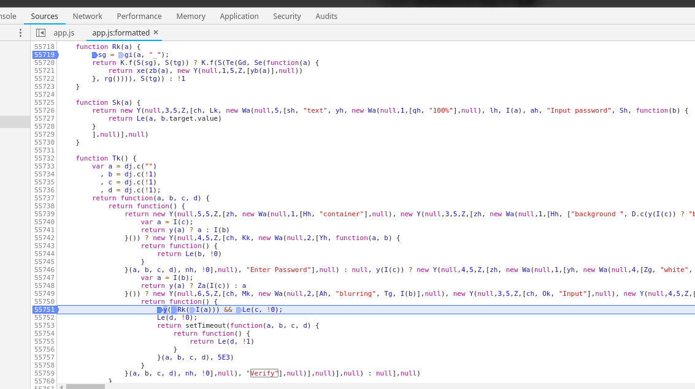
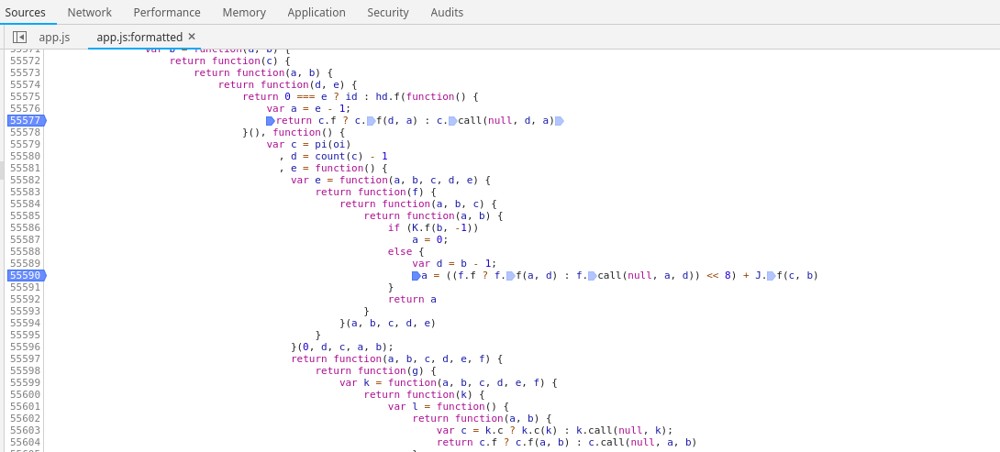

no-js
=====================================

## Challenge (7 solved)

JavaScript is boring, let's try something news.

(chrome >=68)


## Build
### Development mode

To start the Figwheel compiler, navigate to the project folder and run the following command in the terminal:

```
lein figwheel
```

Figwheel will automatically push cljs changes to the browser.
Once Figwheel starts up, you should be able to open the `public/index.html` page in the browser.

### Building for production

```
lein clean
lein package
```


## Writeup
I have to say, it's a very boring challenge.

It's written by ClojureScript. Thanks to ClosureCompiler, it removed most of the useless code so I have to check the final optimization results often. And the variable name below may be different, that because some of the beauty tools, such as Uglifyjs, Prettier, will rename the variable. I used WebStorm to reformat and refactor.

By the way, I found something magical, The code optimized by ClosureCompiler is more readable than unoptimized.

I used ``Reagent`` which is based on ``React`` as UI framework to make it easy for you to find the function ``Rk`` by searching "Verify". ``Rk`` is a function for verify, and ``K.f`` stands for ``eq``, ``S`` stands for ``count``.



First, we know the flag is split by "_" and have 7 parts. Breakpoint into the function inside, we know it's a loop with ``[{key: fn, value: string_of_part1}, ...]``. Look above, ``tg`` is the array we need.


### Part 1
a === "no"

### Part 2
It's very easy to decompile ``li`` and rename it to ``stringToInt``. Just guess ``new Y`` means ``new Vector``, ``Ld`` means ``arrayEquals`` and ``Se`` means ``map``.

### Part 3, 4
Consider the count of ``0`` and the constants of the algorithm in ``mi``, we know it looks like base32. ``Fi`` means ``join``, ``Wb`` means ``reverse``. It's very easy to get alphabets by a breakpoint.


### Part 5
JavaScript reverse. Read ``Ak`` we can easily know it's a md5 algorithm. ``276839132707622690534147184366986393054208n>>10n).toString(16)`` can get the hex ``cb63a762f1571806222efef7ec7f9c1b``. Google it, get ``50me``.

### Part 6


To the code in the screenshot, it's not hard to know there're two Y-combinators. The Y combinator can be used to formally define recursive functions without names. So we should focus on ``if``s and breakpoint it.



Algorithm: [(stringToInt(get(s, i)) << 8 + stringToInt(get(s, i + 1))) << i], i += 2

### Part 7
This only contains two features of Clojure. See: https://clojuredocs.org/clojure.core/for and https://clojuredocs.org/clojure.core/conj.

