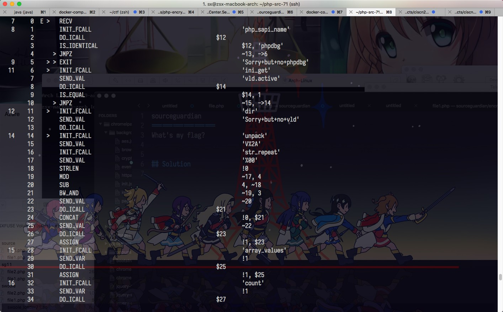

sourceguardian
==================
What's my flag?

## Solution

With the help of modified VLD, you can dump all the opcodes...



You can easily convert these opcodes to PHP code, and you will find it is a XXTEA + Xor. Extract the encrypted string array and the key array then you will get the flag: ``RCTF{h0w_d1d_you_crack_sg11?}``

### Script
```php
function mx($sum, $y, $z, $p, $e, $k) {
    return ((($z >> 5 & 0x07ffffff) ^ $y << 2) + (($y >> 3 & 0x1fffffff) ^ $z << 4)) ^ (($sum ^ $y) + ($k[$p & 3 ^ $e] ^ $z));
}

$v = [1029560848, 2323109303, 4208702724, 3423862500, 3597800709, 2222997091, 4137082249, 2050017171, 4045896598];
$k = [1752186684, 1600069744, 1953259880, 1836016479];
for ($i = 0; $i < count($v); $i++) {
    $v[$i] = $v[$i] ^ $k[$i % 4];
}
$n = count($v) - 1;
$y = $v[0];
$q = floor(6 + 52 / ($n + 1));
$sum = ($q * 0x9E3779B9) & 0xffffffff;
while ($sum != 0) {
    $e = $sum >> 2 & 3;
    for ($p = $n; $p > 0; $p--) {
        $z = $v[$p - 1];
        $y = $v[$p] = ($v[$p] - mx($sum, $y, $z, $p, $e, $k)) & 0xffffffff;
    }
    $z = $v[$n];
    $y = $v[0] = ($v[0] - mx($sum, $y, $z, $p, $e, $k)) & 0xffffffff;
    $sum = ($sum - 0x9E3779B9) & 0xffffffff;
}
$len = $n + 1;
$n = $v[$n];
$s = array();
for ($i = 0; $i < $len; $i++) {
    echo pack("V", $v[$i]);
}
```

### VLD

What?? How did I fuck VLD?

Each time when we call a function with ``DO_FCALL``:

<https://github.com/php/php-src/blob/79f41944babaa4d4ae4f1928fcb999feaf9a48b9/Zend/zend_vm_def.h#L4050>

Or include a new file:

<https://github.com/php/php-src/blob/79f41944babaa4d4ae4f1928fcb999feaf9a48b9/Zend/zend_vm_def.h#L5753>

Zend will always call ``zend_execute_ex``. So just call ``vld_dump_oparray`` in ``vld.c``'s ``vld_execute_ex``,  everything will be shown.

```diff
diff ext/vld/vld.c /home/sx/vld/vld.c
128c128
<     //if (!VLD_G(execute)) {
---
>     if (!VLD_G(execute)) {
130c130
<     //}
---
>     }
346,347c346
<   vld_dump_oparray(&execute_data->func->op_array);
<   return old_execute_ex(execute_data TSRMLS_DC);
```

Now you will find ``<array>`` is not dumped and numbers were truncated using scientific notation, just modify VLD to display them. Replace the functions in ``srm_oparray.c``:

```c
#include "zend_smart_str.h"
#include "ext/standard/php_var.h"

static inline int vld_dump_zval_double(ZVAL_VALUE_TYPE value)
{
	return vld_printf (stderr, "%f", value.dval);
}

static inline int vld_dump_zval_array(zval* value)
{
	smart_str buf = {0};
	php_var_export_ex(value, 1, &buf);
	smart_str_0 (&buf);
	ZVAL_VALUE_STRING_TYPE *new_str;
	new_str = php_url_encode(ZSTRING_VALUE(buf.s), buf.s->len);
	int ret = vld_printf(stderr, "%s", ZSTRING_VALUE(new_str));
	efree(new_str);
	smart_str_free(&buf);
	return ret;
}

int vld_dump_zval (zval val)
  // ....
                  case IS_ARRAY:          return vld_dump_zval_array (&val);
```

Then you will see everything in ``verify``, even the variable name. It does not display some temporary variables that OPCode uses to store return values, but since temporary variables always grow in order, you can guess.

```
filename:       /home/sx/exts/sg11/file1.php
function name:  verify
number of ops:  122
compiled vars:  !0 = $str, !1 = $v, !2 = $b, !3 = $k, !4 = $n, !5 = $z, !6 = $q, !7 = $sum, !8 = $e, !9 = $p, !10 = $y, !11 = $i
line     #* E I O op                           fetch          ext  return  operands
-------------------------------------------------------------------------------------
   7     0  E >   RECV
   8     1        INIT_FCALL                                               'php_sapi_name'
         2        DO_ICALL                                         $12
         3        IS_IDENTICAL                                             $12, 'phpdbg'
         4      > JMPZ                                                     ~13, ->6
   9     5    > > EXIT                                                     'Sorry+but+no+phpdbg'
  11     6    >   INIT_FCALL                                               'ini_get'
         7        SEND_VAL                                                 'vld.active'
         8        DO_ICALL                                         $14
         9        IS_EQUAL                                                 $14, 1
        10      > JMPZ                                                     ~15, ->14
  12    11    >   INIT_FCALL                                               'dir'
        12        SEND_VAL                                                 'Sorry+but+no+vld'
        13        DO_ICALL
  14    14    >   INIT_FCALL                                               'unpack'
        15        SEND_VAL                                                 'V%2A'
        16        INIT_FCALL                                               'str_repeat'
        17        SEND_VAL                                                 '%00'
        18        STRLEN                                                   !0
        19        MOD                                                      ~17, 4
        20        SUB                                                      4, ~18
        21        BW_AND                                                   ~19, 3
        22        SEND_VAL                                                 ~20
        23        DO_ICALL                                         $21
        24        CONCAT                                                   !0, $21
        25        SEND_VAL                                                 ~22
        26        DO_ICALL                                         $23
        27        ASSIGN                                                   !1, $23
  15    28        INIT_FCALL                                               'array_values'
        29        SEND_VAR                                                 !1
        30        DO_ICALL                                         $25
        31        ASSIGN                                                   !1, $25
  16    32        INIT_FCALL                                               'count'
        33        SEND_VAR                                                 !1
        34        DO_ICALL                                         $27
        35        STRLEN                                                   !0
        36        ASSIGN_DIM                                               !1, $27
        37        OP_DATA                                                  ~29
  17    38        ASSIGN                                                   !2, array+%28%0A++0+%3D%3E+1029560848%2C%0A++1+%3D%3E+2323109303.0%2C%0A++2+%3D%3E+4208702724.0%2C%0A++3+%3D%3E+3423862500.0%2C%0A++4+%3D%3E+3597800709.0%2C%0A++5+%3D%3E+2222997091.0%2C%0A++6+%3D%3E+4137082249.0%2C%0A++7+%3D%3E+2050017171%2C%0A++8+%3D%3E+4045896598.0%2C%0A%29
  18    39        ASSIGN                                                   !3, array+%28%0A++0+%3D%3E+1752186684%2C%0A++1+%3D%3E+1600069744%2C%0A++2+%3D%3E+1953259880%2C%0A++3+%3D%3E+1836016479%2C%0A%29
  19    40        INIT_FCALL                                               'count'
        41        SEND_VAR                                                 !1
        42        DO_ICALL                                         $32
        43        SUB                                                      $32, 1
        44        ASSIGN                                                   !4, ~33
  20    45        FETCH_DIM_R                                              !1, !4
        46        ASSIGN                                                   !5, $35
  21    47        INIT_FCALL                                               'floor'
        48        ADD                                                      !4, 1
        49        DIV                                                      52, ~37
        50        ADD                                                      6, ~38
        51        SEND_VAL                                                 ~39
        52        DO_ICALL                                         $40
        53        ASSIGN                                                   !6, $40
  22    54        ASSIGN                                                   !7, 0
  23    55      > JMP                                                      ->101
  24    56    >   ADD                                                      !7, 2654435769.000000
        57        BW_AND                                                   ~43, 4294967295.000000
        58        ASSIGN                                                   !7, ~44
  25    59        SR                                                       !7, 2
        60        BW_AND                                                   ~46, 3
        61        ASSIGN                                                   !8, ~47
  26    62        ASSIGN                                                   !9, 0
        63      > JMP                                                      ->83
  27    64    >   ADD                                                      !9, 1
        65        FETCH_DIM_R                                              !1, ~50
        66        ASSIGN                                                   !10, $51
  28    67        FETCH_DIM_R                                              !1, !9
        68        INIT_FCALL                                               'a'
        69        SEND_VAR                                                 !7
        70        SEND_VAR                                                 !10
        71        SEND_VAR                                                 !5
        72        SEND_VAR                                                 !9
        73        SEND_VAR                                                 !8
        74        SEND_VAR                                                 !3
        75        DO_UCALL                                         $55
        76        ADD                                                      $54, $55
        77        BW_AND                                                   ~56, 4294967295.000000
        78        ASSIGN_DIM                                       $53     !1, !9
        79        OP_DATA                                                  ~57
        80        ASSIGN                                                   !5, $53
  26    81        POST_INC                                                 !9
        82        FREE                                                     ~59
        83    >   IS_SMALLER                                               !9, !4
        84      > JMPNZ                                                    ~60, ->64
  30    85    >   FETCH_DIM_R                                              !1, 0
        86        ASSIGN                                                   !10, $61
  31    87        FETCH_DIM_R                                              !1, !4
        88        INIT_FCALL                                               'a'
        89        SEND_VAR                                                 !7
        90        SEND_VAR                                                 !10
        91        SEND_VAR                                                 !5
        92        SEND_VAR                                                 !9
        93        SEND_VAR                                                 !8
        94        SEND_VAR                                                 !3
        95        DO_UCALL                                         $65
        96        ADD                                                      $64, $65
        97        BW_AND                                                   ~66, 4294967295.000000
        98        ASSIGN_DIM                                       $63     !1, !4
        99        OP_DATA                                                  ~67
       100        ASSIGN                                                   !5, $63
  23   101    >   POST_DEC                                                 !6
       102        IS_SMALLER                                               0, ~69
       103      > JMPNZ                                                    ~70, ->56
  33   104    >   ASSIGN                                                   !11, 0
       105      > JMP                                                      ->114
  34   106    >   FETCH_DIM_R                                              !1, !11
       107        MOD                                                      !11, 4
       108        FETCH_DIM_R                                              !3, ~74
       109        BW_XOR                                                   $73, $75
       110        ASSIGN_DIM                                               !1, !11
       111        OP_DATA                                                  ~76
  33   112        POST_INC                                                 !11
       113        FREE                                                     ~77
       114    >   INIT_FCALL                                               'count'
       115        SEND_VAR                                                 !1
       116        DO_ICALL                                         $78
       117        IS_SMALLER                                               !11, $78
       118      > JMPNZ                                                    ~79, ->106
  36   119    >   IS_EQUAL                                                 !1, !2
       120      > RETURN                                                   ~80
  37   121*     > RETURN                                                   null
```

You will find there's a ``a`` function hidden but VLD didn't decode it, you can call it to let VLD decode.

### Any more?

You can try to decompile ``protected-2.php``, it have no ``DO_FCALL``. So you need to hook ``i_init_func_execute_data``.

For more detail, please read my blog: [从Zend虚拟机分析PHP加密扩展](https://blog.zsxsoft.com/post/40) (Chinese)
